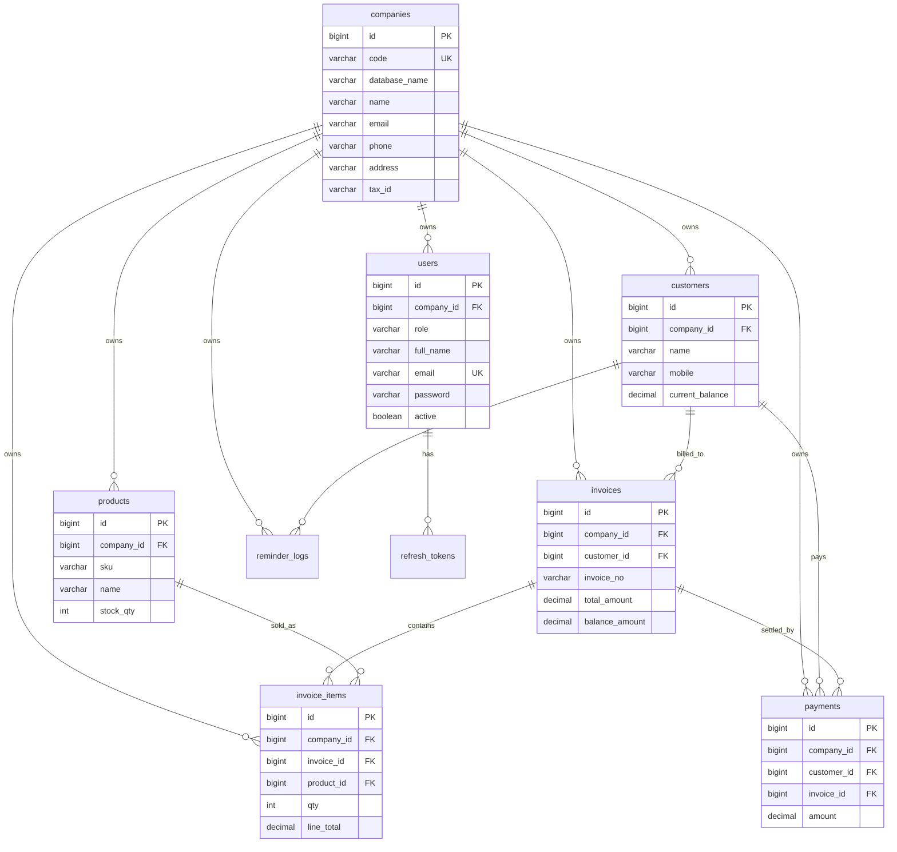

# Multi-Company Architecture

## Current Schema Analysis

The application already used a shared database pattern with a `companies` table and company relationships on most business tables.

Existing tenant-scoped tables:

- `users.company_id`
- `customers.company_id`
- `products.company_id`
- `invoices.company_id`
- `invoice_items.company_id`
- `payments.company_id`
- `reminder_logs.company_id`

Required gaps found:

- `companies` did not have a stable tenant code.
- `companies` did not have optional future database metadata.
- `invoice_items` did not have a direct `company_id`.
- Roles were named `SUPER_ADMIN`, `COMPANY_ADMIN`, and `STAFF` instead of `OWNER`, `ADMIN`, and `USER`.
- JWT already contained `companyId`, but request handling did not expose a centralized tenant context or automatic tenant filter.
- Local configuration had hardcoded database credentials and JWT secret.
- Invoice number uniqueness was global; it should be unique per company.

## Required Table Changes

- Add `companies.code` as unique and required.
- Add nullable `companies.database_name` for future database-per-tenant routing metadata.
- Require `users.company_id` for all application users.
- Add `invoice_items.company_id`, backfilled from `invoices.company_id`.
- Add indexes on every `company_id` column used for tenant filtering.
- Replace existing role values:
  - `COMPANY_ADMIN` to `OWNER`
  - `STAFF` to `USER`
  - `SUPER_ADMIN` should be removed or migrated to a real company owner before enforcing `users.company_id`.
- Change invoice uniqueness from `invoice_no` to `(company_id, invoice_no)`.

## ER Diagram



## Runtime Tenant Isolation

The backend uses shared database multi-tenancy. `TenantContext` is populated from the authenticated JWT user. A Hibernate filter named `tenantFilter` is enabled around service execution, so normal JPA reads automatically include:

```sql
company_id = :logged_in_company_id
```

Service write paths still attach the current company explicitly and validate cross-entity relationships. This protects inserts and produces clearer errors.

## Data Access Boundary

Controllers call services, services call repositories, and repositories remain the only persistence abstraction used by business logic. Tenant selection is not hardcoded in controllers or service methods. Today, the infrastructure layer uses `TenantContext` and Hibernate filtering for shared-database isolation.

`companies.database_name` is metadata only in the current implementation. It is not used to choose a datasource yet. This keeps shared-database behavior deterministic while preserving a place to store future tenant database identifiers.

## Migration Plan

1. Backup the production database.
2. Create `companies.code`, populate existing rows, then enforce uniqueness and not-null.
3. Add nullable `companies.database_name`.
4. Backfill missing `users.company_id` or migrate/remove any platform users that do not belong to a company.
5. Rename roles to `OWNER`, `ADMIN`, and `USER`.
6. Add `invoice_items.company_id`, backfill from `invoices.company_id`, then enforce not-null and foreign key.
7. Drop global unique constraint on `invoices.invoice_no`.
8. Add unique constraint `(company_id, invoice_no)`.
9. Add indexes on all tenant columns.
10. Deploy backend with `HIBERNATE_DDL_AUTO=validate`.
11. Verify cross-company isolation with two companies using identical customer names, SKUs, and invoice numbers.

## Future Database-Per-Tenant Migration Path

The tenant boundary is centralized in `TenantContext`, service-level company resolution, repository abstractions, and entity-level company ownership. In a future database-per-tenant migration, replace the Hibernate filter with a tenant-aware datasource/router that resolves the current company's `database_name`.

Required future changes should be infrastructure-focused:

- Add a tenant datasource registry/router.
- Resolve `database_name` from `company_id` through a cached company lookup.
- Disable or relax Hibernate `tenantFilter` only after each tenant database contains isolated data.
- Keep controller, service, repository method signatures, and JWT `companyId` unchanged.

Do not put database selection logic inside business services. That keeps migration from shared database to database-per-tenant small and reversible.
